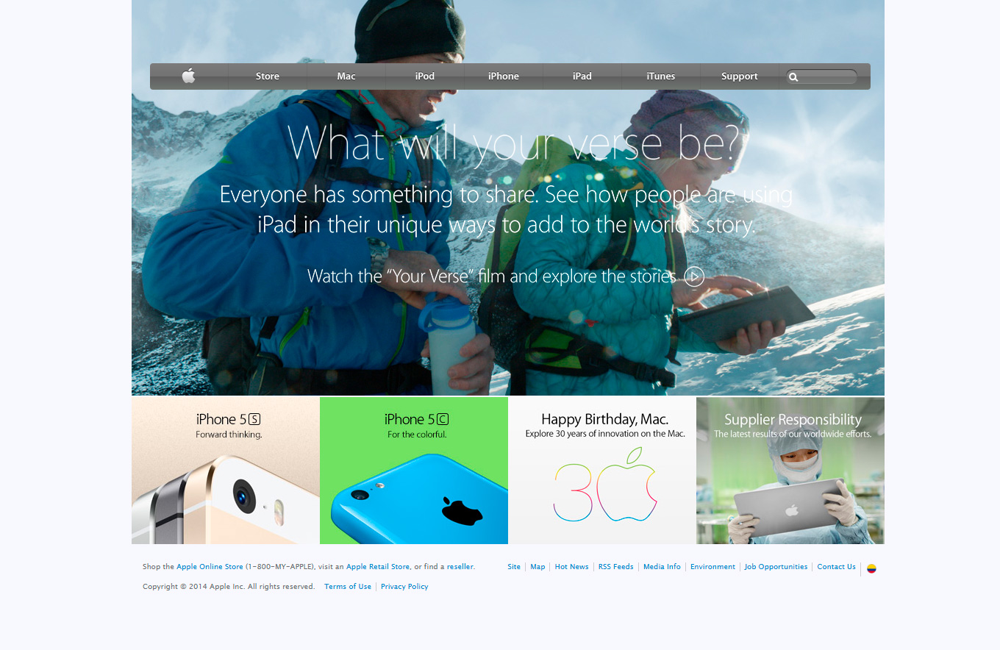

# HTML&CSS: Backgrounds and Gradients

Within this proyect, I will construct a clone of old homepage from Apple Inc. Required tools:

  - CSS background property
  - linear-gradient values
  - Any available tool to form layouts like flexbos, css-grid, position CSS property.

## Author

👤 **Mauricio Santos**

- Github: [@githubhandle](https://github.com/maosan132)
- Linkedin: [linkedin](https://www.linkedin.com/in/mauricio-santos-a7292910)

## Screenshot

## live Demo

[https://rawcdn.githack.com/maosan132/backgrounds-and-gradients/bd04de25eae62ebd8df02d7e768cb852efd938a8/index.html]

## 🤝 Contributing

Contributions, issues and feature requests are welcome!

Feel free to check the [issues page](issues/).

## Show your support

Give a ⭐️ if you like this project!

## Acknowledgments

- Hat tip to anyone whose code was used
- Inspiration
- etc

## 📝 License

This project is [MIT](lic.url) licensed.

**Free Software, Hell Yeah!**
